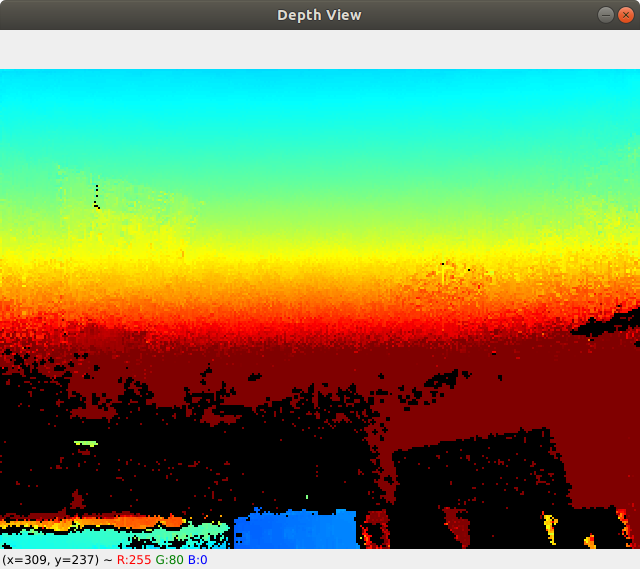

# Python Wrapper for LIPSedge SDK

## Requirements

In order to run these python samples you need to do following requirements:

Install the **LIPSedge SDK**, check [here](https://www.lips-hci.com/lipssdk) to download latest SDK.

* On Linux, you need:
    1. Enter the SDK folder and type below command to launch installation.
       ``$ sudo ./install.sh``

    2. A development config text 'OpenNIDevEnvironment' is created for you to setup OpenNI2 software development environment.
       Next time if you want to setup it quickly, just sourcing it in your shell.

       ``$ source OpenNIDevEnvironment``

    3. Copy the required OpenNI2 and LIPSedge driver libraries to here.

       ``$ cp -r $OPENNI2_REDIST/* ./``

        * After files copied, you should see **libOpenNI2.so** and directory **OpenNI2/Drivers** in this folder.

* On Windows, you need:
    1. Install **LIPSedge SDK** by clicking the .exe file to complete installation.

    2. Copy the following OpenNI2 and LIPSedge driver libraries from "C:/Program Files/OpenNI2/Redist/" to here.
        * OpenNI2.dll
        * OPENNI2/Drivers/DeviceModule2.dll
        * OPENNI2/Drivers/RvcLib.dll

## Running samples

In both Linux and Windows, you will need **Python 3** with the following python modules:

  * openni==2.3.0
     * ``$ pip install openni==2.3.0``
     * the required package is **OpenNI2 and NiTE2 python bindings** - [Source](https://github.com/severin-lemaignan/openni-python) / [Release 2.3.0](https://libraries.io/pypi/openni)

  * numpy
     * ``$ pip install numpy``

  * cv2
     * ``$ pip install --upgrade opencv-python``
   
To run sample, type command like:
* ``$ python3 ./cv_display_depth_frame.py``

